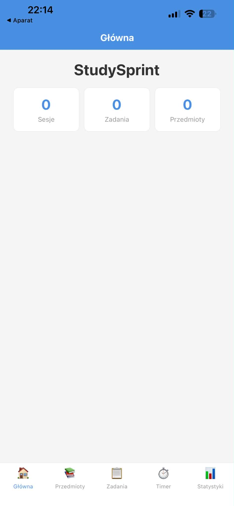
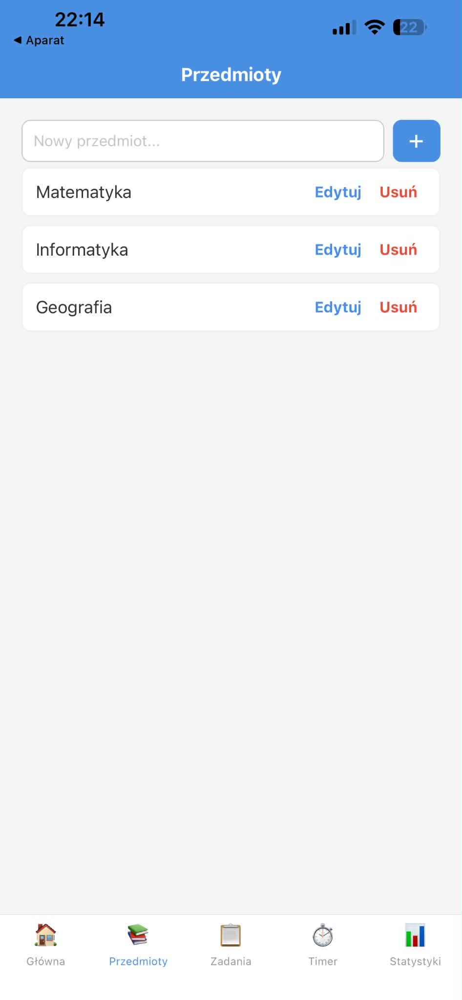
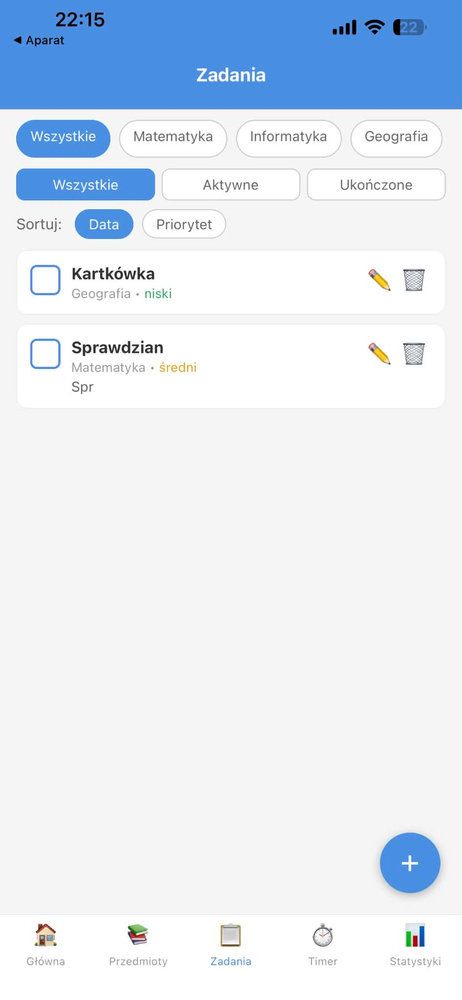
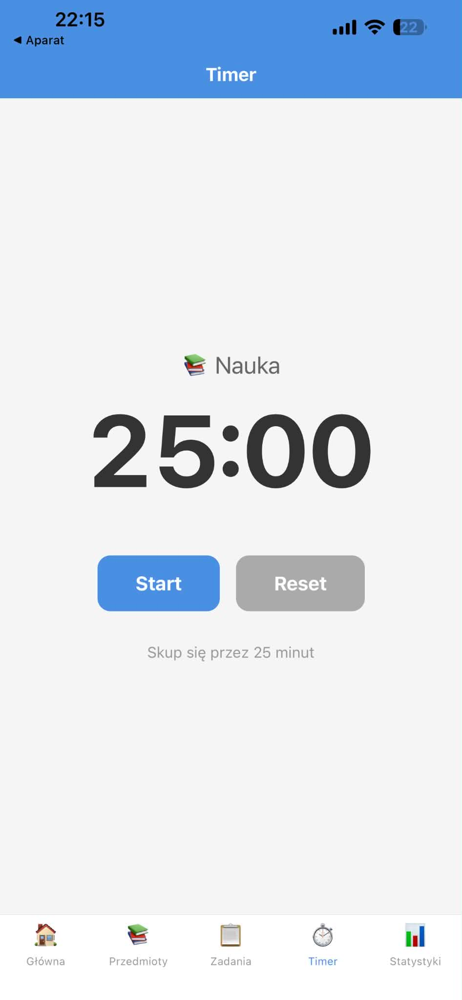
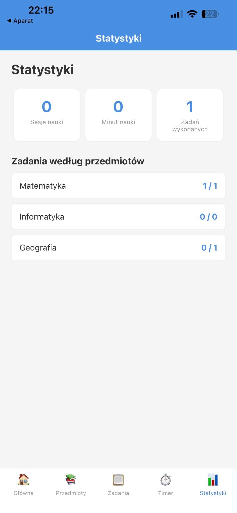

# StudySprint 📚

Mobilna aplikacja do zarządzania nauką metodą Pomodoro. Pozwala organizować
przedmioty, planować zadania z priorytetami, mierzyć czas nauki (timer 25/5)
oraz śledzić statystyki postępów. Zbudowana w React Native + Expo.

> ⚠️ **Status:** projekt w trakcie realizacji. Lista funkcji, których jeszcze
> brakuje do pełnego zaliczenia, znajduje się w pliku [`audit.md`](./audit.md).

---

## ✨ Funkcjonalności

- **Główna** – podsumowanie: liczba sesji nauki, ukończonych zadań i przedmiotów.
- **Przedmioty** – dodawanie, edycja i usuwanie przedmiotów (np. Matematyka, Fizyka).
- **Zadania** – tworzenie zadań z opisem, priorytetem (wysoki/średni/niski)
  i przypisaniem do przedmiotu; filtrowanie (przedmiot, status) i sortowanie
  (data, priorytet); oznaczanie jako ukończone.
- **Timer** – pomodoro 25 min nauki / 5 min przerwy z automatycznym zapisem sesji.
- **Statystyki** – łączny czas nauki, liczba sesji, postęp zadań per przedmiot.

Wszystkie dane są zapisywane lokalnie na urządzeniu (AsyncStorage) i dostępne
po ponownym uruchomieniu aplikacji — również offline.

---

## 🛠️ Użyte technologie

| Obszar         | Technologia                                 |
| -------------- | ------------------------------------------- |
| Framework      | React Native `0.81.5` + Expo `~54`          |
| Język          | JavaScript (React `19.1`)                   |
| Nawigacja      | React Navigation – Bottom Tabs              |
| Przechowywanie | `@react-native-async-storage/async-storage` |
| Testy          | Jest + `jest-expo`                          |
| Jakość kodu    | ESLint 9 (`eslint-config-expo`) + Prettier  |

---

## 🚀 Uruchomienie (w mniej niż 5 minut)

### Wymagania wstępne

- Node.js 18+ oraz npm
- Aplikacja **Expo Go** na telefonie (Android/iOS) **lub** emulator Android / symulator iOS

### Kroki

```bash
# 1. Sklonuj repozytorium
git clone <URL_REPOZYTORIUM>
cd StudySprint2

# 2. Zainstaluj zależności
npm install

# 3. Uruchom serwer deweloperski Expo
npm start
```

Następnie:

- **Telefon:** zeskanuj kod QR z terminala aplikacją Expo Go.
- **Android:** naciśnij `a` (uruchomi emulator) lub `npm run android`.
- **iOS:** naciśnij `i` lub `npm run ios`.
- **Web:** naciśnij `w` lub `npm run web`.

---

## 🧪 Testy

Projekt zawiera ok. 35 testów jednostkowych pokrywających logikę zadań,
przedmiotów, timera i statystyk.

```bash
npm test
```

---

## 📁 Struktura projektu

```
StudySprint2/
├── App.js                    # Punkt wejścia – SafeAreaProvider + nawigacja
├── src/
│   ├── navigation/
│   │   └── AppNavigator.js    # Bottom Tabs (5 ekranów)
│   ├── screens/              # Ekrany (Home, Subjects, Tasks, Timer, Stats)
│   ├── components/
│   │   └── TaskForm.js       # Współdzielony formularz zadania
│   ├── logic/                # Czysta logika biznesowa (testowalna)
│   │   ├── tasksLogic.js
│   │   ├── subjectsLogic.js
│   │   ├── timerLogic.js
│   │   └── statsLogic.js
│   └── utils/
│       └── storage.js        # Wrapper na AsyncStorage (save/load)
└── __tests__/                # Testy jednostkowe logiki
```

**Decyzja architektoniczna:** cała logika biznesowa (walidacja, CRUD, filtrowanie,
formatowanie czasu, obliczanie statystyk) jest wydzielona z komponentów do
modułów `src/logic/`. Dzięki temu jest w pełni testowalna bez renderowania UI,
a komponenty ekranów pozostają cienką warstwą prezentacji + stanu lokalnego.

---

## 📸 Zrzuty ekranu

|                 Główna                  |                Przedmioty                 |               Zadania               |
| :-------------------------------------: | :---------------------------------------: | :---------------------------------: |
|  |  |  |

|               Timer               |               Statystyki               |
| :-------------------------------: | :------------------------------------: |
|  |  |

> 📷 **Jak dograć własne zrzuty:** uruchom aplikację (`npm start`), zrób screenshoty
> każdego ekranu i zapisz je w folderze [`screenshots/`](./screenshots) pod nazwami
> `home.png`, `subjects.png`, `tasks.png`, `timer.png`, `stats.png`. Instrukcja
> robienia zrzutów (w tym GIF-ów) znajduje się w [`screenshots/README.md`](./screenshots/README.md).

---

## 📌 Status realizacji kryteriów

Szczegółowe zestawienie spełnionych i brakujących wymagań zaliczeniowych
znajduje się w pliku [`audit.md`](./audit.md).
